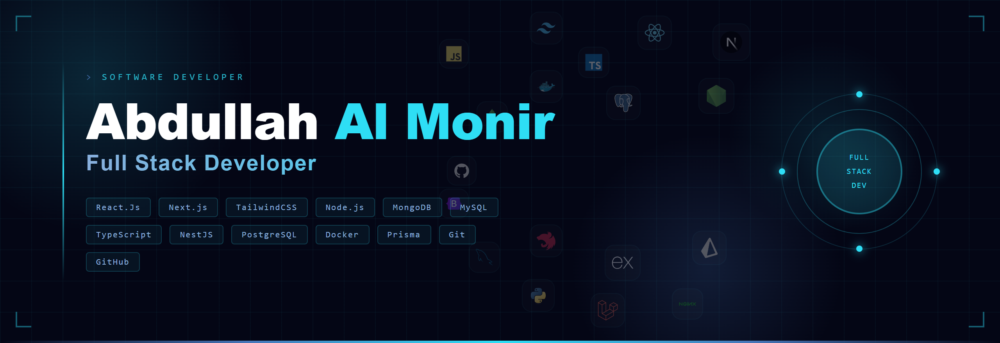

##  About Me

<h2> Hi, I'm Abdullah Al Monir</h2>

<!-- ================= PROFESSIONAL SUMMARY ================= -->

## 🚀 Software Developer | Full-Stack & DevOps

From crafting elegant interfaces with <b>shadcn/ui</b> to managing <b>VPS servers with Nginx</b> and containerizing apps with <b>Docker</b>, I enjoy owning the <b>full lifecycle of production-grade software</b> — from idea to deployment.

I focus on writing clean, maintainable code while ensuring <b>performance, scalability, and security</b>.

---

<!-- ================= EXPERIENCE ================= -->

## 💼 Professional Experience

<h3>Full Stack Developer — Everything Green Limited</h3>
<b>February 2026 – Present</b>
<ul>
  <li>Building scalable full-stack applications using <b>Next.js and Express.js</b>.</li>
  <li>Containerizing services with <b>Docker</b> for consistent dev and production environments.</li>
  <li>Managing data with <b>PostgreSQL</b> and <b>Prisma ORM</b> for type-safe database operations.</li>
  <li>Leveraging <b>ClickHouse</b> for high-performance analytical data processing.</li>
  <li>Integrating <b>Stripe, Cloudinary, and NodeMailer</b> for payments, media, and email.</li>
</ul>

<h3>Software Developer — Synchronise IT</h3>
<b>November 2024 – December 2025</b>
<ul>
  <li>Promoted to full-time role after demonstrating strong technical ownership and delivery.</li>
  <li>Building robust production applications using <b>React.js, Next.js, Laravel, and Inertia.js</b>.</li>
  <li>Handling <b>VPS deployment, Nginx configuration, and server optimization</b>.</li>
  <li>Working closely with product teams to ship scalable features.</li>
</ul>

<h3>Software Developer Trainee — Synchronise IT</h3>
<b>March 2024 – October 2024</b>
<ul>
  <li>Gained intensive hands-on experience in full-stack web development workflows.</li>
  <li>Strengthened knowledge of frontend and backend fundamentals.</li>
  <li>Learned real-world project structure, version control, and team collaboration.</li>
</ul>

---

<!-- ================= SKILLS ================= -->

## 🛠️ Tech Stack & Skills

<h3>🎨 Frontend & UI</h3>
<ul>
  <li><b>Frameworks:</b> React.js, Next.js</li>
  <li><b>Styling:</b> Tailwind CSS, shadcn/ui, Bootstrap</li>
  <li><b>Logic & SPA:</b> JavaScript (ES6+), Inertia.js</li>
</ul>

<h3>⚙️ Backend & Infrastructure</h3>
<ul>
  <li><b>Languages & Frameworks:</b> Node.js (Express), PHP (Laravel), Python</li>
  <li><b>Databases:</b> MySQL, MongoDB, Firebase</li>
  <li><b>Email Services:</b> Nodemailer, EmailJS, Resend</li>
</ul>

<h3>☁️ DevOps & Deployment</h3>
<ul>
  <li><b>Server Management:</b> VPS, Nginx, PM2</li>
  <li><b>Cloud & Hosting:</b> Hostinger, Vercel, Render, Firebase Hosting</li>
</ul>

<h3>🧠 Computer Science Foundations</h3>
<ul>
  <li><b>Core:</b> C, C++, Data Structures & Algorithms (DSA), OOP</li>
</ul>

---

<!-- ================= CURRENT FOCUS ================= -->

## 🔭 Current Focus

<ul>
  <li>🚀 <b>Currently:</b> Working as a Full Stack Developer</li>
  <li>🌱 <b>Exploring:</b> NestJS, Prisma, ClickHouse & Docker</li>
  <li>🎯 <b>Goal:</b> Building high-impact products with a focus on performance, scalability & UX</li>
</ul>

## ⚡ Fun Facts

- 🌙 I code better at night
- ☕ Powered by coffee and curiosity
- 🚀 Always exploring new technologies and keeping up with the latest in the tech world
   

## 📧 Contact Me
  

 

##  Social

##  Technologies & Proficiencies

### 🌐 Frontend Development

---

### 🎨 Styling & UI Components

---

### ⚙️ Backend & Languages

---

### 🗄️ Database & Storage

---

### 🚀 DevOps & Hosting

---

### 🛠️ Services & Utils

---

### 🎨 Design

---

### 💻 Programming Languages

##  Featured Projects

| Project Name     | Description               | Technologies Used                                                                          | Repository Links                                                                                                                                         | Image (Live Link)                                                                     |
| ---------------- | ------------------------- | ------------------------------------------------------------------------------------------ | -------------------------------------------------------------------------------------------------------------------------------------------------------- | ------------------------------------------------------------------------------------- |
| Neighbr          | An artisan platform       | NextJs, ExpressJs, MongoDB,JWT, Stripe, EmailJS,Shadcn                                     | [Client Side](https://github.com/abdullah-al-monir/neighbr-frontend), [Server Side](https://github.com/abdullah-al-monir/neighbr-backend)                |                   |
| Work Atlas       | Job Recruitment Site      | ReactJs, TailwindCSS, Firebase, MongoDB, ExpressJs, NodeJs                                 | [Client Side](https://github.com/abdullah-al-monir/work-atlas-client), [Server Side](https://github.com/abdullah-al-monir/work-atlas-server)             |                  |
| Automotive Oasis | Online Car Shop Website   | ReactJs, TailwindCSS, Firebase, MongoDB, ExpressJs, NodeJs                                 | [Client Side](https://github.com/abdullah-al-monir/online-car-shop-client), [Server Side](https://github.com/abdullah-al-monir/online-car-shop-server)   |  |
| NexGen Diagnosia | Diagnostic Center Website | ReactJs, Material UI, Firebase, MongoDB, ExpressJs, NodeJs, JWT, Stripe Js, Tanstack Query | [Client Side](https://github.com/abdullah-al-monir/nexgen-diagnosia-client), [Server Side](https://github.com/abdullah-al-monir/nexgen-diagnosia-server) |  |

##  GitHub Activity

  

    
    

    
    

  

